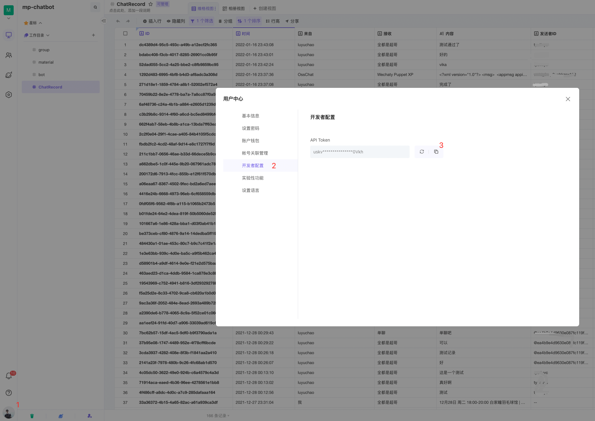
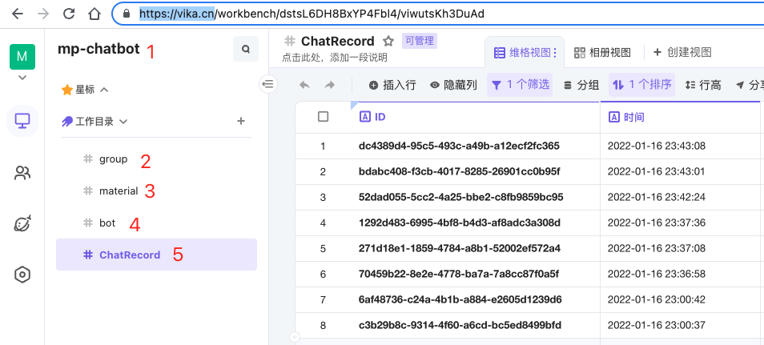
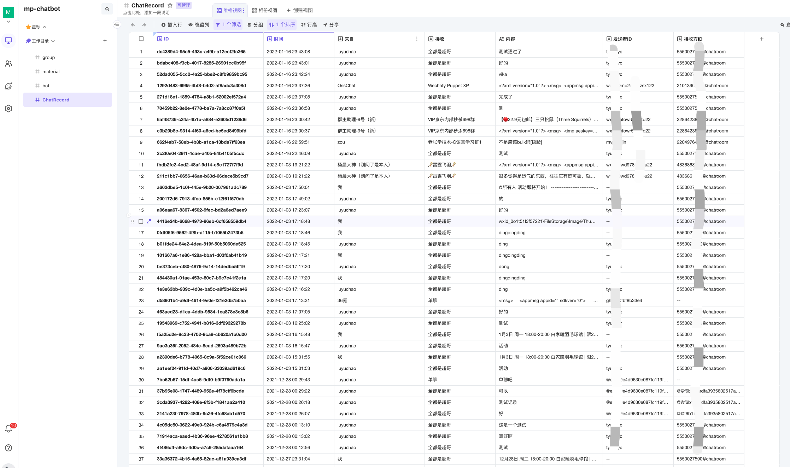

# WechatyVikaUploader

## 简介

wechaty微信机器人聊天消息备份到维表格vika插件

支持wechaty 1.x

## 快速入门

1. 到 [维格表官网](https://vika.cn/) 注册维格表账号

2. 创建一个维格表空间

3. 获取维格表token



4. 配置维格表信息

```
const VIKA_TOKEN = 'xxxxx' // VIKA维格表token
const VIKA_SPACENAME = 'xxxxx'  // VIKA维格表空间名称
```

5. 运行如下命令配置环境变量，示例中使用了padlocal，可以自行更换为其他puppet，可以在 [padlocal官网](http://pad-local.com/#/login) 申请7天免费token

```
export WECHATY_PUPPET=wechaty-puppet-padlocal
export WECHATY_PUPPET_PADLOCAL_TOKEN="替换为padloac token"
```
> 当前版本需要在主程序文件相同目录下新建一个folder文件夹用于存放文件缓存

6. 运行 

```
npm run ding-dong-bot
```

> 首次运行时，会自动在空间下创建Room、Message、Contact、Wechaty、Event 5个系统表，可参考ripe-vika.ts,设置是否同步RoomList和ContactList到维格表



## NPM方式安装

该插件已发布为npm包

安装:

```
npm install wechaty-vika-link@next

```

使用demo参考 examples/ripe-npm.js

## 效果展示



## 版本

main v1.0.4

1. 自动创建wechaty类对应的系统表
2. 支持主动同步群和联系人列表
3. 表字段按wechaty类一一对应

v0.17.0

1. 变更表字段名称为英文命名方式
2. 表结构

    ```
    [
    {
        fields: {
        _id: '8647378336392492845',
        timeHms: '2022-05-09 00:44:44',
        name: 'luyuchao',
        topic: '专属清单Discard',
        messagePayload: 'hhh',
        wxid: 'xxxx',
        roomid: '20641535286@chatroom',
        messageType: 'Text',
        file: []
        }
    }
    ]
    ```
